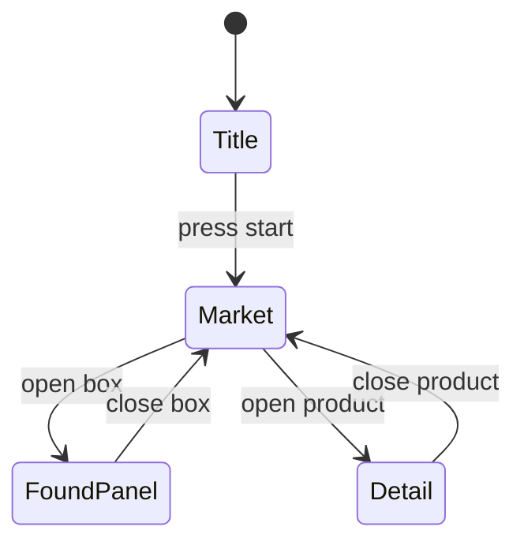

# Retro Video-Game Redesign — Market Design Study (Plan)

> Sandbox-only. Everything here lives in `apps/market/design-study/**` and
> `docs/design/oshi/**` (plus this plan). No production apps, no `packages/**`,
> no new dependencies, no live services. See `Instructions.md`,
> `apps/market/design-study/AGENTS.md`, and `docs/design/oshi/README.md`.
>
> **This checklist is the source of truth.** Re-read it before starting any
> slice. Build one slice at a time; do not batch slices.

## Direction

Turn the Market home study into a retro video-game storefront with a modern,
minimal, functional skin: a 90s-style **title/start screen** that opens into a
clean marketplace, a **Zelda-style found-items box** for collecting products, a
**static sticky header**, a search bar, and user-controlled **on/off settings**.
Motion comes from the `transitions-dev` recipes and their motion-token scale,
applied tastefully. Colors draw from the Oshi palette.

Working branch: `feat/market-home-design-study-tangent`.

## Locked decisions (Phase 0)

1. **Start screen**: shows on first load and once per session only. Persist a
   `sessionStorage` flag; reloads within the session skip straight to Market.
   The start prompt is always skippable and a real, focusable button.
2. **Found-items box replaces the demo cart entirely.** No separate cart. The
   collect flow is the only "add" path. Checkout is a themed no-op.
3. **Settings are user-controlled and multi-toggle**, behind a persistent,
   visible settings control (a marked header button that opens a panel). No
   hidden gestures. Initial toggle set (adjust during Phase 3):
   - CRT / scanline overlay on or off
   - Grid density: comfortable or compact
   - Motion level: full or reduced, layered on top of `prefers-reduced-motion`
   - Store labels on product tiles on or off
     Settings persist in `localStorage` on the study origin only.
4. **Phase 1 first** (game shell plus start screen), then stop and review before
   Phase 2. Build little by little.

## Non-negotiable constraints (from repo + study rules)

- Edit only inside `apps/market/design-study/**` and `docs/design/oshi/**`.
- Keep the shared primitive bridge `src/ui.ts` read-only in intent; wiring in
  existing primitives is allowed, editing `packages/ui` is not.
- No signers, relays, wallets, real checkout, analytics, or customer data.
- No new dependencies; no remote image/font services. The page CSP is local-only
  (`index.html`), so **no external or pixel fonts** and no remote assets. Retro
  look is CSS geometry only.
- Preserve keyboard accessibility, contrast, responsive behavior, the theme
  switcher, and the visible "Design study / sample data" notice.
- Keep sample data fictional. Favor simple, adjustable code.

## Shared primitive inventory (verified in `packages/ui/src/components`)

Bridge through `src/ui.ts` where useful:

- **Reuse**: `Switch`, `Checkbox`, `Tabs` (segmented filters), `Popover`,
  `Sheet` (sides top/bottom/left/right, good for the found-items panel and
  mobile settings), `Skeleton`, `SearchInput`, `Dialog`, `Select`, `Input`,
  `Button`, `ThemeToggleButton`.
- **Missing, so hand-roll CSS-only**: Accordion, Slider, Tooltip, Toast. Prefer
  native `
` for folds and a `role="status"` region for toasts.

## Screen model (study-local state, not a router)

Use an explicit screen state in `StudyPage.tsx` rather than adding routing.

- **Title**: logo lockup, blinking start prompt, skip control, control hints.
  Attract-mode visuals CSS-only. Gates the market content with `inert` and
  `aria-hidden` while shown.
- **Market**: sticky header (brand, search, theme switch, settings, item count),
  folding filter panel, square product tiles, bottom found-items HUD.
- **Detail**: reuse the existing Dialog, reskinned.
- **FoundPanel**: expands from the bottom HUD; "check out" is a themed no-op.

## Component inventory (all study-local)

| File                   | Role                                                                           |
| ---------------------- | ------------------------------------------------------------------------------ |
| `StudyPage.tsx`        | Screen orchestration + shared state (collected items, filters, toggles, query) |
| `StartScreen.tsx`      | Title/attract screen and start prompt                                          |
| `SettingsPanel.tsx`    | Multi-toggle settings, opened from a header control                            |
| `FilterPanel.tsx`      | Folding filter section using the existing filters                              |
| `GameHud.tsx`          | Sticky bottom found-items bar, count, expand control                           |
| `FoundItemSlot.tsx`    | Square collectible slot with glyph and stack count                             |
| `StudyProductCard.tsx` | Retro square tile, bevel frame, collect action                                 |
| `ProductArtwork.tsx`   | CSS-only retro placeholder artwork                                             |
| `fixtures.ts`          | Optional collectible metadata such as rarity and glyph                         |
| `study.css`            | Game skin tokens, bevels, CSS textures, motion tokens, Oshi palette            |
| `ui.ts`                | Bridge only; add a shared primitive only if a matching one exists              |

## Motion map (transitions-dev recipes)

| Moment                              | Recipe                                                          |
| ----------------------------------- | --------------------------------------------------------------- |
| Title to Market reveal              | 07 panel reveal or 08 page side by side                         |
| Cursor pixel displacement field     | Canvas 2D per-cell loop, pointer-driven, reduced-motion guarded |
| Blinking start prompt and scanlines | CSS loops, reduced-motion guarded                               |
| Item collected                      | 03 notification badge plus 02 number pop in                     |
| HUD box expand                      | 07 panel reveal or 20 plus to menu morph                        |
| Settings open                       | 05 menu dropdown or 06 modal                                    |
| Filter fold                         | 21 accordion expand                                             |
| Segmented filters                   | 16 tabs sliding                                                 |
| Feature on/off                      | 27 toggle                                                       |
| Option select                       | 25 checkbox check                                               |
| Tile hover                          | 19 card hover tilt, desktop only, gated                         |
| Loading grid                        | 14 skeleton reveal plus 31 matrix loader                        |
| Empty state                         | 18 texts reveal                                                 |
| Checkout dialog                     | 06 modal                                                        |
| Item toast                          | 22 toast                                                        |
| Search clear                        | 13 input clear dissolve                                         |

Adopt the shared motion tokens from `.agents/skills/transitions-dev/_root.css`.
Tune to the token scale with the `transitions-polish` skill during Phase 5.

## Phased slices (each independently testable; do not build all at once)

### Phase 1 — Game shell + start screen (DO THIS FIRST, THEN STOP)

**Status: done.** Start screen ships behind a `sessionStorage` once-per-session
gate; typecheck, lint, build, and all 14 browser tests pass in both themes.

Deliverable: the study opens on a retro Title screen, "press start" reveals the
Market with a smooth transition, and the existing grid keeps working unchanged
below. Minimal retro styling only; full reskin is Phase 2.

- Add `StartScreen.tsx`: full-viewport overlay with the brand lockup, a blinking
  "Press Start" button (real, focusable, `aria-label="Enter the market"`), a
  visible "Skip" control, and short control hints. Focus the Start button on
  mount. Gate market content with `inert`/`aria-hidden`.
- Add screen state to `StudyPage.tsx`: `"title" | "market"`, initialized from a
  `sessionStorage` flag so it appears once per session; already-started sessions
  go straight to Market.
- Install the reveal transition for the Title to Market handoff: use
  `transitions-dev` 07 panel reveal (or 08 page side by side if the overlay
  cross-blur reads better). Keep the recipe verbatim, hooks and
  `prefers-reduced-motion` guard included.
- Do not touch the grid, cards, filters, or cart logic yet.
- Update `tests/study.playwright.ts`: add a helper that dismisses the title
  screen and call it at the start of existing tests; add one new test proving
  the title shows on first load, Enter reveals the market, and a same-session
  reload skips it. Capture title and market screenshots, desktop and phone.
- Exit criteria: study build and browser checks pass; both themes render;
  375px has no horizontal overflow.

### Phase 2 — Full market surface redesign (no data or interaction changes)

**Status: done.** Game skin tokens, both theme palettes, sticky framed header,
square bevel tiles, CSS-only artwork, framed filter panel, category tabs, empty
state, control rail, and the entry-screen restyle are all in. Data shape and
interaction behaviour are unchanged; typecheck, lint, build, and all 16 browser
tests pass in both themes.

**Correction (Phase 2.5):** the first pass shipped invented ground colors (a
"Zelda paper" `#EFE8D4` and a "Cyberpunk black" `#0A0612`) that appear nowhere
in the palette documentation. Color must come from the five anchors in
[`docs/design/oshi/palette.md`](../../docs/design/oshi/palette.md) only. The
references below inform **layout and interaction vocabulary, never color.**

**Visual references (frozen):**

- **Day Market = Zelda: Breath of the Wild / Tears of the Kingdom** — square item
  slots, selection outline, `xN` count badges, an icon category tab row, and a
  bottom control-hint bar. Playful but modern cartoon temperament with generous
  whitespace. (Layout vocabulary only; colors are Oshi.)
- **Night Market = Cyberpunk 2077 pixel art** — thin geometric frames and
  hard-edged pixel glyphs, no gradients or soft shadows. (Layout vocabulary
  only; colors are Oshi.)
- Beveled square slot grids (Diablo II / RuneScape) reinforce the tile and
  found-items box vocabulary.
- **Palette (authoritative)**: purple `#9A72AA`, orange `#F15A30`, gray
  `#B6BFC1`, teal `#62C6BF`, olive `#8B835B`. No pixel fonts and no image assets
  (local-only CSP); the "pixel" feel comes from square geometry, bevels, hard
  edges, uppercase tracking, and CSS-only grid/scanline textures.

**Derived surfaces (Phase 2.5).** `palette.md` ships five anchors but no
background values, and notes the gray "would change surface/border semantics."
Grounds are therefore derived from anchors rather than invented:

- **Day** — ground is an Olive `#8B835B` tint (warm paper); panels are a deeper
  Olive tint, slots a brighter one; ink and borders are Olive-derived; accents
  are Purple, Teal, Orange. Gray is **not** used as a day background.
- **Night** — ground is Olive `#8B835B` darkened; panels and slots are lightened
  Olive; ink and borders are Gray derived; accents are Purple, Teal, Orange.

Purple, Teal, and Orange stay reserved for accents (primary action, secondary
highlight, selection/active) so one control language holds across both themes.

Phase 1 intentionally left the market looking like the previous design so the
intro could be verified in isolation. **Phase 2 is where the market is actually
redesigned**, not merely restyled. Every visible surface below the title screen
changes to the retro game language; data shape and interaction behaviour stay
the same.

Redesign all of these, not a subset:

- **Design language**: introduce game skin tokens in `study.css` — bevel/inset
  borders, hard pixel-free edges, square corners, the Oshi palette mapped to
  surfaces and accents, and CSS-only textures (no image or pixel-font assets).
- **Title screen restyle**: bring the Phase 1 intro onto the same game language
  and Oshi palette so the start button is no longer production purple.
- **Sticky header**: square retro frame, dividers, restyled brand, search, theme
  switcher, and action controls.
- **Product tiles**: switch to square bevel tiles with retro framing and the
  collect control's visual language (behaviour still wired in Phase 4).
- **CSS-only artwork**: replace the generic lucide placeholders with a retro
  treatment driven by the existing `artwork` metadata.
- **Filters and results row**: restyle the category buttons, shop/sort selects,
  count line, empty state, and the "Study controls" disclosure.
- **Footer and notices**: restyle to match the game shell.

- Update every affected test (for example the "No image available" copy) and
  re-capture desktop and phone screenshots in both themes.

### Phase 2.6 — 8-bit animated entry backdrop

**Status: removed.** The CSS-layer scenery (`StudyBackdrop.tsx`: sky, celestial,
starfields, clouds, ridges, grid floor, gems, scanlines, vignette, plus
pointer/wheel parallax) was built and verified, then removed on review — the
scene read too busy behind the entry overlay. The component, its `--bg-*`
tokens, and its CSS block are gone; the pixel displacement field (Phase 2.7) is
now the only backdrop. The `.study-entry` overlay keeps `background: none` with
the radial scrim on `.study-entry-inner` (solid `--game-surface` for the denser
discovery panel), and the button click animation is unchanged.

### Phase 2.7 — Living pixel field (MarketQuest)

**Status: done.** `StudyPixelField.tsx` is the sole entry backdrop: a canvas-2D
field of chunky pixels over a themed ground, tuned to feel alive for
**MarketQuest** rather than a static wallpaper. Three systems run per frame:

- **Ambient drift** — every cell breathes on a slow travelling wave, so the
  whole field gently undulates even with no pointer. This is the always-on
  "game" baseline.
- **Cursor comet (velocity-sensitive)** — the pointer is a moving body whose
  _speed_ drives the effect, not just its position. A smoothed velocity estimate
  feeds a non-linear energy curve with a raised floor and a hot top end: slow
  movement still reads clearly, but a fast flick spikes the field. Energy scales
  the push distance, the influence radius, the scale/colour gain, and the
  comet's directional shove along the pointer's travel — so the same gesture
  reads gentle when slow and violent when fast. A short trail of
  recently-visited cells stays energized and colour-shifted toward the Oshi
  accent trio (Purple/Teal/Orange), then cools back to the base.
- **Click ripple** — a pointerdown drops an expanding ring at the click point.
  The wavefront shoves and ignites cells as it sweeps outward (hottest at the
  leading edge), throws a small burst of sparkles around the impact, and cools
  over ~1s. A deliberate tap sends a pulse reverberating through the field.
- **Sparkles** — a few cells at a time ignite into accent-coloured flares that
  scale up, glow, and die, like loot glinting. They spawn on a timer and in the
  pointer's wake.

The grid is dense (CELL 20px, GAP 1.5px) and each cell blends its accent with a
neighbour's on a slow phase, so colour shifts flow as a coherent wave across the
field rather than a sparse checkerboard.

Canvas 2D (not WebGL) is deliberate — the chunky per-cell loop is the look and
needs no shaders or textures. Colours are read live from the `--field-*` custom
properties (`--field-ground`, `--field-base`, `--field-accent-1/2/3`) so the
field follows the active theme without a restart, and a `MutationObserver` on
`data-theme` re-reads them on flip. The grid is coarse and the rAF only runs
while something is moving (pointer active, cells easing, or a sparkle alive),
so idle cost is zero. Under `prefers-reduced-motion: reduce` the field renders
once as a static grid and never listens for the pointer. The canvas is
`pointer-events: none` at `z-index: 69` — below the entry panel (70) — and
paints its own themed `--field-ground` so it stands alone.

### Phase 3 — Filter and settings panel

- Fold the existing search, category, shop, and sort into a folding panel
  (native `
` or accordion recipe). Add the multi-toggle settings panel
  opened from a persistent header control, using `Switch` from the bridge.
  Wire the four locked toggles and persist them.
- Update tests and screenshots.

### Phase 4 — Found-items HUD

- Replace the demo cart with the collect action into a bottom item box: count
  pop, expandable review panel (`Sheet` from the bottom), and themed no-op
  checkout. Remove the cart dialog.
- Rewrite cart-related tests as collect/box tests.

### Phase 5 — Motion polish

- Install the remaining chosen recipes, tokenize durations and easings to the
  shared scale, run `transitions-polish`, and audit reduced-motion and contrast
  across both themes.

### Phase 6 — Harden and hand off

- Responsive and a11y pass at 375px and 1440px; run `typecheck:study`, lint,
  `build:study`, and the study browser checks; capture both-theme screenshots;
  write the design-choice summary per the study README.

## Risks and dependencies

- **Tests will break by design.** `tests/study.playwright.ts` asserts specific
  copy and structure ("No image available", "Demo cart, N items", counts,
  `Study controls`, preview states). Update the tests each slice touches.
- **CSP and assets.** No pixel fonts or remote art; the retro look must be CSS
  geometry only. Hard boundary, not a preference.
- **Mobile 375px.** Tests assert `scrollWidth <= innerWidth`. The sticky header
  plus sticky bottom HUD must not overflow; the HUD needs safe-area insets and
  can sit over mobile browser chrome.
- **Accessibility gating.** The title overlay must not trap or hide focusable
  market content from assistive tech; use `inert`/`aria-hidden` correctly.
- **Theme parity.** The retro treatment must read well in Day and Night Market.
- **Scope creep.** Keep 3 to 4 active type sizes per view; prefer the
  lower-overhead transition when two fit.

## Open questions (deferred, non-blocking)

1. Should a small "return to title" affordance exist after starting?
2. Should collected items persist across reloads, or reset like the demo cart?
3. Exact collectible glyph/rarity vocabulary and the fourth toggle.
